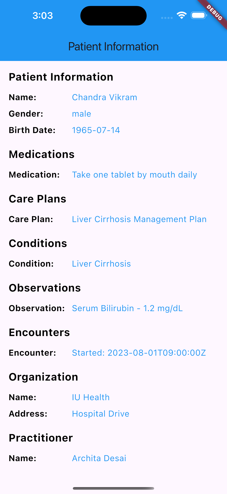
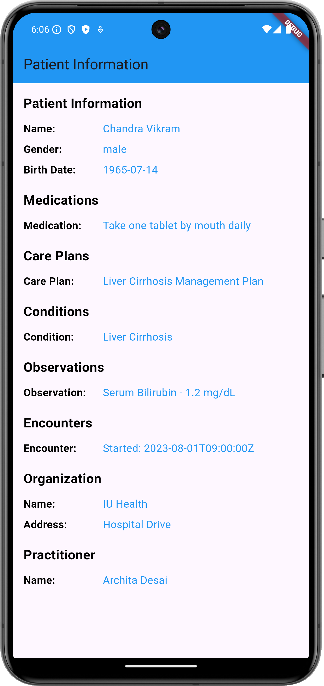

# Patient FHIR Data Viewer - Flutter Application

This Flutter project demonstrates how to connect to a local **HAPI FHIR** server, post patient-related data, and retrieve that data using the **Patient/$everything** operation. The data is then displayed in a Flutter mobile application.

## Project Overview

This project connects to a locally running HAPI FHIR server (hosted at `http://localhost:8080`) and fetches the following FHIR resources for a patient:

- **Patient**
- **MedicationRequest**
- **CarePlan**
- **Condition**
- **Observation**
- **Encounter**
- **Organization**
- **Practitioner**

### Data Displayed:

- **Patient Details**: Name, Gender, Birth Date
- **Medications**: Medication information, dosage instructions
- **Care Plans**: Care plans and their details
- **Conditions**: Active conditions related to the patient (e.g., Liver Cirrhosis)
- **Observations**: Laboratory observations (e.g., Serum Bilirubin levels)
- **Encounters**: Information about encounters (e.g., visits, encounters)
- **Organization**: Details about the healthcare organization
- **Practitioner**: Information about the practitioner assigned to the patient

## Requirements

- **Flutter SDK**: Install from [Flutter SDK Installation](https://flutter.dev/docs/get-started/install)
- **HAPI FHIR Server**: A locally running HAPI FHIR server. You can download and run it by following the instructions from the official HAPI FHIR website: [HAPI FHIR Docker](https://hub.docker.com/r/hapiproject/hapi).

## Screenshots





## Setup Instructions

### 1. Clone the Repository

```bash
git clone https://github.com/your-repo/patient-fhir-viewer.git
cd patient-fhir-viewer
```

### 2. Install Flutter Dependencies

```bash
flutter pub get
```

### 3. Setup HAPI FHIR Server
If you are using Docker, start the HAPI FHIR server with the following command:

```bash
If you are using Docker, start the HAPI FHIR server with the following command:
```
### 4. Post Data to the HAPI FHIR Server
To simulate patient data, use Postman to post the following data to the HAPI FHIR server:

## Step 1: Post a Patient Resource
```json
{
  "resourceType": "Patient",
  "id": "7",
  "name": [
    {
      "use": "official",
      "family": "Vikram",
      "given": ["Chandra"]
    }
  ],
  "gender": "male",
  "birthDate": "1965-07-14",
  "address": [
    {
      "use": "home",
      "line": ["123 Main St"],
      "city": "Indianapolis",
      "state": "IN",
      "postalCode": "46202",
      "country": "USA"
    }
  ]
}
```
## Step 2: Post a MedicationRequest Resource
```json
{
  "resourceType": "MedicationRequest",
  "status": "active",
  "intent": "order",
  "medicationReference": {
    "reference": "Medication/10"
  },
  "subject": {
    "reference": "Patient/7"
  },
  "authoredOn": "2023-07-10T00:00:00Z",
  "requester": {
    "reference": "Practitioner/9"
  },
  "dosageInstruction": [
    {
      "text": "Take one tablet by mouth daily"
    }
  ]
}
```
## Step 3: Post a CarePlan Resource
```json
{
  "resourceType": "CarePlan",
  "status": "active",
  "intent": "plan",
  "title": "Liver Cirrhosis Management Plan",
  "description": "A care plan for managing liver cirrhosis, including medication, diet, and regular follow-ups.",
  "subject": {
    "reference": "Patient/7"
  },
  "period": {
    "start": "2023-07-01T00:00:00Z"
  },
  "activity": [
    {
      "detail": {
        "code": {
          "coding": [
            {
              "system": "http://snomed.info/sct",
              "code": "183276004",
              "display": "Low-sodium diet"
            }
          ]
        },
        "status": "in-progress",
        "description": "Follow a low-sodium diet and monitor fluid retention."
      }
    }
  ]
}
```
## Step 4: Post a Condition Resource
```json
{
  "resourceType": "Condition",
  "clinicalStatus": {
    "coding": [
      {
        "system": "http://terminology.hl7.org/CodeSystem/condition-clinical",
        "code": "active",
        "display": "Active"
      }
    ]
  },
  "verificationStatus": {
    "coding": [
      {
        "system": "http://terminology.hl7.org/CodeSystem/condition-ver-status",
        "code": "confirmed",
        "display": "Confirmed"
      }
    ]
  },
  "code": {
    "coding": [
      {
        "system": "http://snomed.info/sct",
        "code": "4567007",
        "display": "Liver Cirrhosis"
      }
    ]
  },
  "subject": {
    "reference": "Patient/7"
  },
  "onsetDateTime": "2023-06-01T00:00:00Z",
  "recordedDate": "2023-06-05T00:00:00Z"
}
```
## Step 5: Post an Observation Resource
```json
{
  "resourceType": "Observation",
  "status": "final",
  "category": [
    {
      "coding": [
        {
          "system": "http://terminology.hl7.org/CodeSystem/observation-category",
          "code": "laboratory",
          "display": "Laboratory"
        }
      ]
    }
  ],
  "code": {
    "coding": [
      {
        "system": "http://loinc.org",
        "code": "1920-8",
        "display": "Serum Bilirubin"
      }
    ]
  },
  "subject": {
    "reference": "Patient/7"
  },
  "effectiveDateTime": "2023-07-15T00:00:00Z",
  "valueQuantity": {
    "value": 1.2,
    "unit": "mg/dL",
    "system": "http://unitsofmeasure.org",
    "code": "mg/dL"
  }
}
```
## Step 6: Post an Encounter Resource
```json
{
  "resourceType": "Encounter",
  "status": "finished",
  "class": {
    "system": "http://terminology.hl7.org/CodeSystem/v3-ActCode",
    "code": "AMB",
    "display": "Ambulatory"
  },
  "subject": {
    "reference": "Patient/7"
  },
  "period": {
    "start": "2023-08-01T09:00:00Z",
    "end": "2023-08-01T10:00:00Z"
  },
  "reasonCode": [
    {
      "coding": [
        {
          "system": "http://snomed.info/sct",
          "code": "4567007",
          "display": "Liver Cirrhosis"
        }
      ]
    }
  ]
}
```
## Step 7: Post an Practitioner Resource
```json
{
  "resourceType": "Practitioner",
  "id": "9",
  "name": [
    {
      "use": "official",
      "family": "Desai",
      "given": ["Archita"]
    }
  ],
  "qualification": [
    {
      "code": {
        "text": "MD"
      }
    }
  ]
}
```
## Step 8: Post an Organization Resource
```json
{
  "resourceType": "Organization",
  "id": "8",
  "name": "IU Health",
  "address": [
    {
      "line": ["Hospital Drive"],
      "city": "Indianapolis",
      "state": "IN",
      "postalCode": "46202",
      "country": "USA"
    }
  ]
}
```
### 5. Fetch Data Using the Flutter Application

Once the data is posted, the Flutter app fetches the patient’s data using the Patient/$everything operation. This operation retrieves all related resources (such as Patient, MedicationRequest, CarePlan, Condition, Observation, Encounter, Organization, and Practitioner) and displays them in the app.

The app uses HTTP GET requests to retrieve this data and presents it in a structured way.

### 6. Run the Flutter Application

```bash
flutter run
```
### 7. Technologies Used
	•	Flutter: For building the mobile application.
	•	HAPI FHIR: As the FHIR server backend.
	•	Postman: For posting sample FHIR data to the server.
	•	Docker: Used to host the HAPI FHIR server locally for development.
